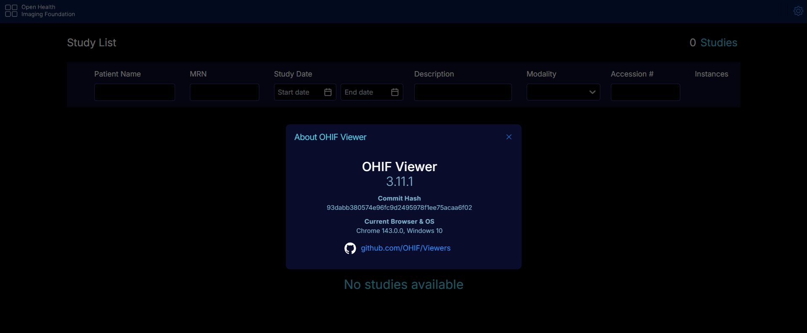

# Instalasi dcm4che + OHIF Viewer dengan Basic Auth

Setup dcm4che, dan OHIF Viewer di Ubuntu Server 24.04 dengan basic authentication via NGINX.

## Requirement

- OS: Ubuntu Server 24.04 LTS
- Docker Engine 24.0+
- Docker Compose 2.0+
- Hardware: CPU 2 core, RAM 4GB, Storage 20GB

---

## Spesifikasi yang Akan Diinstall

| Komponen | Versi | Fungsi |
|----------|-------|--------|
| DCM4CHEE Archive | 5.34.1 | PACS Archive Server |
| OHIF Viewer | latest | Medical Image Viewer |
| PostgreSQL | 17.4 | Database |
| LDAP (slapd) | 2.6.8 | Directory Server |
| NGINX | latest | Reverse Proxy & Basic Auth |
| Portainer | latest | Container Management |

---

## Preview Hasil Instalasi

### DCM4CHEE UI (Web Interface)


### OHIF Viewer


> **Catatan:** Tambahkan file gambar ke folder `images/` untuk menampilkan preview hasil instalasi.

---

## 1. Instalasi Docker

### 1.1 Hapus Docker Lama

```bash
sudo apt remove $(dpkg --get-selections docker.io docker-compose docker-compose-v2 docker-doc podman-docker containerd runc | cut -f1)
```

### 1.2 Setup Repository Docker

```bash
sudo apt update
sudo apt install -y ca-certificates curl
sudo install -m 0755 -d /etc/apt/keyrings
sudo curl -fsSL https://download.docker.com/linux/ubuntu/gpg -o /etc/apt/keyrings/docker.asc
sudo chmod a+r /etc/apt/keyrings/docker.asc

sudo tee /etc/apt/sources.list.d/docker.sources <<EOF
Types: deb
URIs: https://download.docker.com/linux/ubuntu
Suites: $(. /etc/os-release && echo "${UBUNTU_CODENAME:-$VERSION_CODENAME}")
Components: stable
Signed-By: /etc/apt/keyrings/docker.asc
EOF

sudo apt update
```

### 1.3 Install Docker

```bash
sudo apt install -y docker-ce docker-ce-cli containerd.io docker-buildx-plugin docker-compose-plugin
sudo systemctl enable --now docker
```

---

## 2. Download Repository

```bash
cd /opt
sudo git clone https://github.com/krisnadwiki/dcm4che-ohif3.git
cd dcm4che-ohif3
```

---

## 3. Struktur Folder

```
dcm4che-ohif3/
├── docker-compose.yml
├── .env
├── nginx/
│   ├── nginx.conf
│   ├── htpasswd
│   └── certs/
├── ohif/
│   ├── app-config.js
│   └── logo.png
└── README.md
```

---

## 4. Konfigurasi

### 4.1 File `.env`

Edit `.env` sesuai IP server Anda:

```bash
DOCKER_HOST=192.168.12.44
PACS_DB_PASSWORD=pacs
```

**Update IP dari command line:**

Ganti IP `192.168.100.50` dengan IP server Anda:

```bash
sudo sed -i 's/192.168.12.44/192.168.100.50/g' .env
```

Verifikasi perubahan:

```bash
cat .env
```

### 4.2 File `nginx/htpasswd` - Basic Authentication

Default: `admin:admin123` (hash: `$apr1$kH8v4h4k$o8Bwonv9pSGaIPim47j4Z1`)

**Cara mudah - gunakan script:**

```bash
sudo chmod +x update-htpasswd.sh
sudo ./update-htpasswd.sh
```

Script ini akan:
- Pilih opsi: buat/update user, tambah user, atau lihat user
- Input username dan password (dengan konfirmasi)
- Generate hash otomatis
- Update file htpasswd
- Restart nginx secara otomatis

**Atau manual dengan nano:**

```bash
sudo nano nginx/htpasswd
```

Edit dan ganti password hash, simpan dengan Ctrl+X → Y → Enter.

### 4.3 File `nginx/nginx.conf`

Sudah dikonfigurasi dengan:
- **Port 3571**: Akses internal OHIF Viewer tanpa auth (VLAN lokal)
- **Port 80**: HTTP dengan basic auth
- **Port 443**: HTTPS dengan basic auth

Tidak perlu diubah.

### 4.4 Custom File `ohif/app-config.js` - [Opsional]

**Custom logo dan nama aplikasi (opsional):**

```javascript
whiteLabeling: {
  createLogoComponentFn: function(React) {
    return React.createElement(
      'div',
      {
        className: 'header-brand',
        style: {
          display: 'flex',
          alignItems: 'center',
          cursor: 'pointer',
        },
        onClick: function(e) {
          e.preventDefault();
          if (window.location.pathname !== '/') {
            window.history.pushState({}, '', '/');
            window.dispatchEvent(new PopStateEvent('popstate'));
          }
        }
      },
      [
        React.createElement('div', {
          key: 'logo',
          style: {
            background: 'url(/logo.png)',
            backgroundSize: 'contain',
            backgroundRepeat: 'no-repeat',
            width: '30px',
            height: '30px',
            marginRight: '12px',
          },
        }),
        React.createElement('span', {
          key: 'text',
          style: {
            color: 'white',
            fontSize: '20px',
            fontWeight: '600',
            whiteSpace: 'nowrap',
          },
        }, 'OHIF - Hospital Name')
      ]
    );
  },
},
```

Letakkan `logo.png` di folder `ohif/`.

---

## 5. Firewall

### UFW (Ubuntu/Debian)

```bash
sudo ufw allow 80/tcp     # HTTP (OHIF dengan login)
sudo ufw allow 443/tcp    # HTTPS (OHIF dengan login)
sudo ufw allow 3571/tcp   # OHIF tanpa login
sudo ufw allow 8080/tcp   # HTTP DCM4CHEE Web Interface & Management
sudo ufw allow 9000/tcp   # Portainer
sudo ufw allow 11112/tcp  # DICOM Connections (Modalities)
sudo ufw allow 2575/tcp   # HL7 Receiver
sudo ufw enable
```

---

## 6. Jalankan Container

```bash
cd /opt/dcm4che-ohif3
sudo docker compose pull
sudo docker compose up -d
sudo docker ps
```

**Container yang aktif:**
- `ldap` - LDAP Server
- `postgres` - Database
- `dcm4chee-arc` - PACS Archive
- `ohif-viewer` - Viewer
- `nginx` - Reverse Proxy
- `portainer` - Management

---

## 7. Akses Layanan

| Layanan | URL | Auth | Akses |
|---------|-----|------|-------|
| OHIF Viewer (dengan Login) | `http://SERVER_IP/` | Basic Auth | Public |
| OHIF Viewer (tanpa Login) | `http://SERVER_IP:3571/` | Tidak | VLAN Lokal |
| DCM4CHEE UI | `http://SERVER_IP:8080/dcm4chee-arc/ui2` | Tidak | VLAN Lokal |
| DICOM Service | `SERVER_IP:11112` | Protocol DICOM | Network |
| Portainer | `http://SERVER_IP:9000` | - | Lokal |

**Contoh (IP `192.168.12.44`):**

```
OHIF Viewer (dengan Login):
http://192.168.12.44/
Username: admin
Password: admin123

OHIF Viewer (tanpa Login - VLAN):
http://192.168.12.44:3571/

DCM4CHEE UI (VLAN):
http://192.168.12.44:8080/dcm4chee-arc/ui2
```

---

## 8. Troubleshooting

### Container tidak berjalan

```bash
sudo docker ps -a
sudo docker compose logs
sudo docker compose restart
```

### Tidak bisa akses OHIF

```bash
curl -u admin:admin123 http://localhost/
curl http://localhost:8080/
nc -zv localhost 11112
```

### Basic auth tidak bekerja

```bash
cat nginx/htpasswd
openssl passwd -apr1
echo "admin:hash_baru" > nginx/htpasswd
sudo docker compose restart nginx
```

### Sertifikat HTTPS error

```bash
mkdir -p nginx/certs
openssl req -x509 -nodes -days 365 -newkey rsa:2048 \
  -keyout nginx/certs/privkey.pem \
  -out nginx/certs/fullchain.pem
sudo docker compose restart nginx
```

---

## 9. Update & Maintenance

```bash
# Pull image terbaru
sudo docker compose pull
sudo docker compose up -d

# Stop container
sudo docker compose down

# Lihat log real-time
sudo docker compose logs -f dcm4chee-arc
sudo docker compose logs -f nginx
```

---

## Port Summary

| Port | Service | Tujuan |
|------|---------|--------|
| 80 | nginx | HTTP (OHIF + Basic Auth) |
| 443 | nginx | HTTPS (OHIF + Basic Auth) |
| 3571 | nginx | Internal OHIF Viewer |
| 8080 | dcm4chee | HTTP Web Interface & Management |
| 8443 | dcm4chee | HTTPS Web Interface & Management |
| 11112 | dcm4chee | DICOM Connections (Modalities) |
| 2575 | dcm4chee | HL7 Receiver |
| 9000 | portainer | Web UI |
| 9443 | portainer | HTTPS UI |

---

## Lisensi

- [dcm4che](https://github.com/dcm4che/dcm4che) - Apache License 2.0
- [OHIF Viewer](https://github.com/OHIF/Viewers) - MIT License
